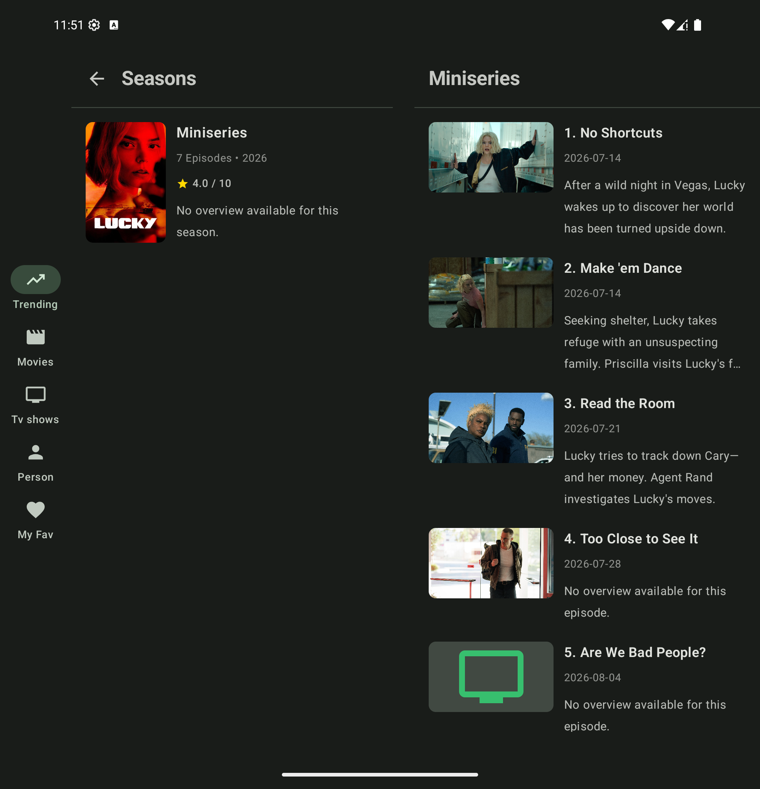
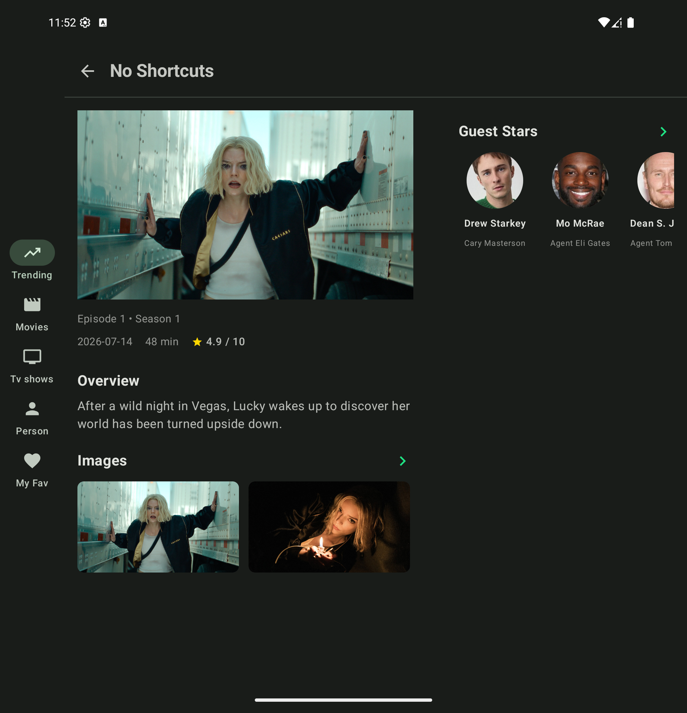
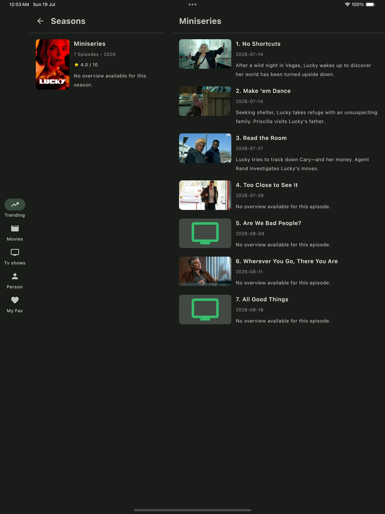
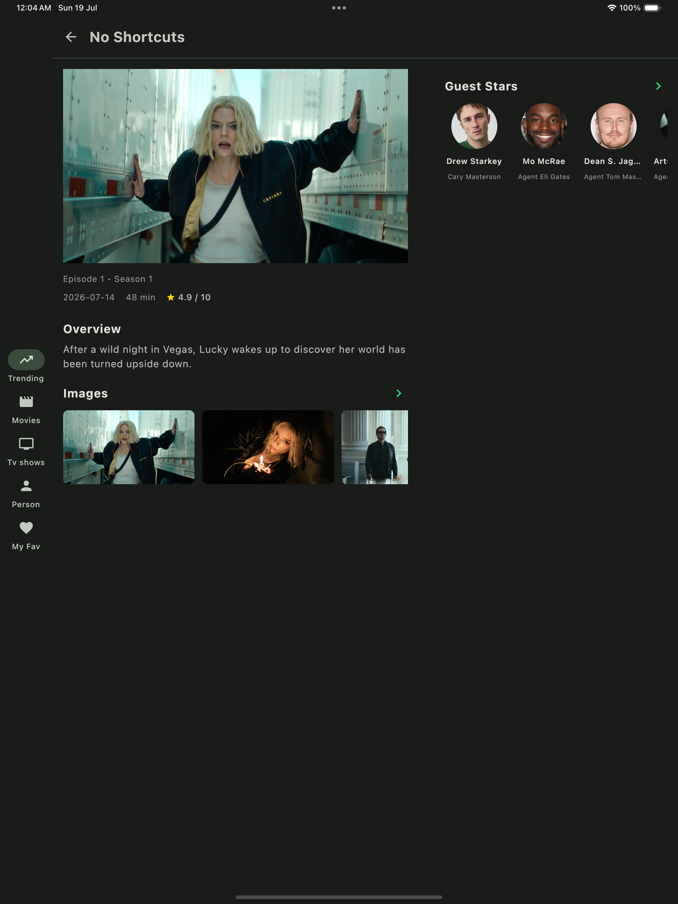
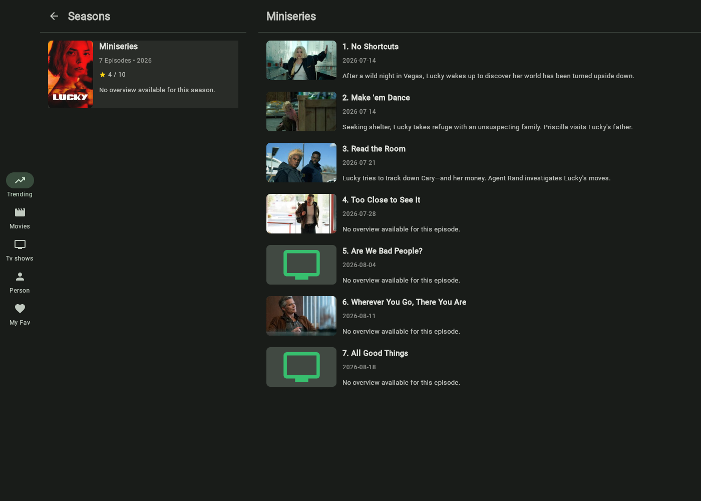
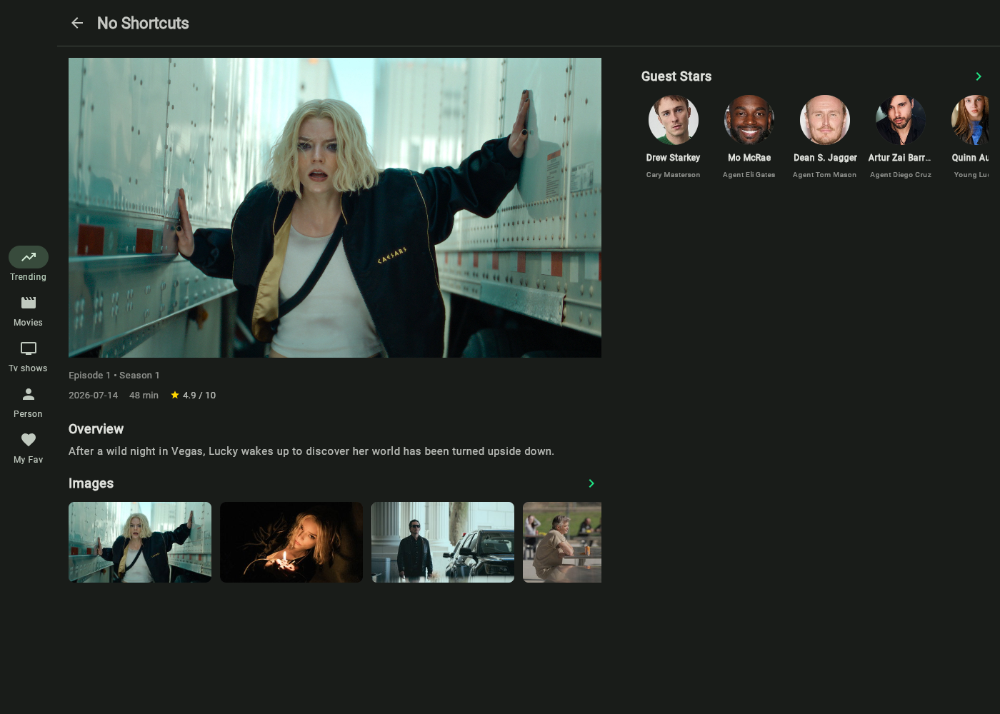

# Compose Multiplatform Application

## Before running!
- check your system with [KDoctor](https://github.com/Kotlin/kdoctor)
- install JDK 17 on your machine
- add `local.properties` file to the project root and set a path to Android SDK there
- **Set up the TMDB API Key**: The application uses The Movie Database (TMDB) API. You need to obtain an API key and make it available to the build system:
  1. Register and request an API key at [The Movie Database (TMDB)](https://www.themoviedb.org/).
  2. Add the key to your global Gradle properties file (usually located at `~/.gradle/gradle.properties` on macOS/Linux or `%USERPROFILE%\.gradle\gradle.properties` on Windows) to prevent accidentally committing it to Git:
     ```properties
     MY_WATCH_LIST_TMDB_API_KEY=your_api_key_here
     ```
     *(Alternatively, you can temporarily add it to the project's root `gradle.properties` file, but be careful not to commit it.)*

### Android
To run the application on android device/emulator:
- open project in Android Studio and run imported android run configuration

To build the application bundle:
- run `./gradlew :composeApp:assembleDebug`
- find `.apk` file in `composeApp/build/outputs/apk/debug/composeApp-debug.apk`

### Desktop
Run the desktop application: `./gradlew :composeApp:run`

### iOS
To run the application on iPhone device/simulator:
- Open `iosApp/iosApp.xcproject` in Xcode and run standard configuration
- Or use [Kotlin Multiplatform Mobile plugin](https://plugins.jetbrains.com/plugin/14936-kotlin-multiplatform-mobile) for Android Studio

### Browser
Run the browser application: `./gradlew :composeApp:jsBrowserDevelopmentRun`

demo
[](https://youtu.be/mwLZfRtcDw8)

## Screenshots & Layouts

Dark Mode captures for each build variant.

### 1. Desktop Target

#### Desktop (Compact Size)


#### Desktop (Medium/Normal Size)


#### Desktop (Expanded Size - Maximized)


### 2. Android Target

#### Android (Folded - Compact)


#### Android (Unfolded - Tablet)


### 3. iOS Target

#### iOS (iPhone 16 - Compact)


#### iOS (iPhone 16e - Compact / Small Device)


#### iOS (iPad Pro 13-inch - Tablet/Expanded)


### 4. Browser (Web) Target

#### Web (Browser App)


### 5. TV Show Episodes (Seasons & Episode Detail)

TV show detail now drills down into a full Seasons/Episodes list and a dedicated Episode Detail screen (overview, guest stars, images).

#### Android
| Episodes List (Seasons + Episodes) | Episode Detail |
| :---: | :---: |
|  |  |

#### iOS
| Episodes List (Seasons + Episodes) | Episode Detail |
| :---: | :---: |
|  |  |

#### Browser (Web)
| Episodes List (Seasons + Episodes) | Episode Detail |
| :---: | :---: |
|  |  |

> Desktop screenshots for this feature are not captured yet — see the "Desktop screenshot automation" item below.

## Upcoming Features (Based on TMDB OpenAPI Spec)

- [ ] **Integrated Search Feature**:
  - Connect the Top Bar's search bar to a functional search results screen that aggregates movies, TV shows, and people using `/3/search/multi` (with keystroke debouncing).
- [ ] **Account Favorites & Watchlist**:
  - Add favorite/watchlist support (using guest sessions or account IDs) in the "My Fav" tab with sub-tabs for "Favorites" and "Watchlist".
  - Add a "Favorite" (heart) button on media cards to mark/unmark items.
- [ ] **Media Detailed Views (Movies & TV Shows)**:
  - Create a premium detailed screen Composable featuring a large backdrop banner image, basic metadata, horizontal cast list, trailers, and recommended media.
- [ ] **Genre-based Discovery Screen**:
  - Let users filter and explore movies/shows by genres, release year, language, or popularity sorting options using `/3/discover` endpoints.
- [ ] **TMDB User Authentication / Login**:
  - Allow users to log in securely using TMDB credentials (request token, session ID generation) to sync favorites, watchlist, and ratings.
- [ ] **Desktop screenshot automation**:
  - Coordinate-based UI automation (`cliclick` + synthetic `CGEvent` scroll/click) against the live Compose Desktop window proved unreliable for navigating into clickable rows (Season list, episode cards) — clicks silently no-op when the target/gap boundary is misjudged, with no error signal to correct against.
  - Capture the Desktop Episodes List and Episode Detail screenshots (`desktop_episodes_list_detail_dark.png`, `desktop_episode_detail_dark.png`) once a more reliable driver exists — e.g. a Compose UI test harness that navigates via semantics (like `runComposeUiTest`) rather than blind screen coordinates, or a manual capture.


